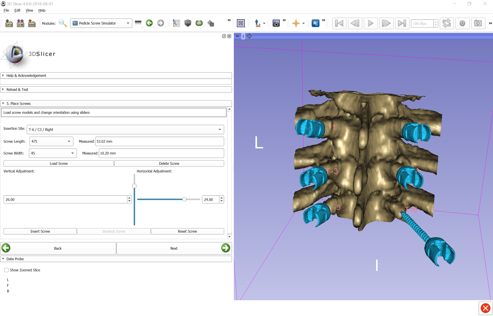
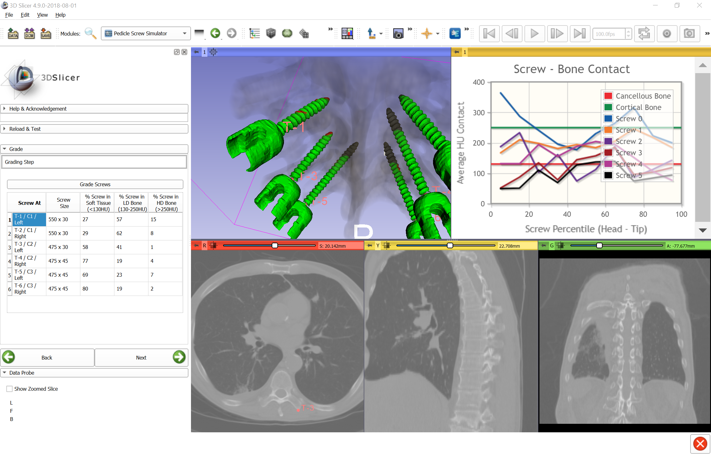

# PedicleScrewPlanner

> A new concise and unified imaging solution for percutaneous pedicle insertion.

## About the Pedicle Tirangle

The author mainly made improvements to [LandmarksStep.py](https://github.com/lassoan/PedicleScrewSimulator/blob/master/PedicleScrewSimulator/PedicleScrewSimulatorWizard/LandmarksStep.py) of this project.We proposed the concept of **the Pedicle Tirangle**, which refers to the three points of the same vertebral body: **the Vertebral Anterior Point (VAP)** and **the Pedicle Isthmus Point(PIP)** of the left and right, formed by  As shown in the figure below: the VAP refers to the anterior midpoint of the vertebral body, and the PIP is based on the largest transverse diameter of the vertebral canal as the coronal plane, and the midpoint of the pedicle on both sides of the plane.  According to these three points, the plug-in forms the axis of the pedicle by connecting the VAP and the lPIP and rPIP, respectively. In addition, we also designs a preliminary estimate of the length and radius of the pedicle screw.

## Tutorial

- Place **the Vertebral Anterior Point (VAP)** and **the Pedkcle Isthmus Point(PIP)** for each level

  

  

- Adjust Screws:
    - Select a insertion point;
    - In the Red Slice or the Yellow Slice, Drag the end of the analog screw to adjust the length and angle;
    - Updata;
    - Select the Diameter of the screw;
    - After reaching the ideal size and angle,Click OK Generate the Screw.

  

- Click "Grade screws" to get detailed analysis of bone contact:

  

作者主要是针对这个项目的[LandmarksStep.py](https://github.com/lassoan/PedicleScrewSimulator/blob/master/PedicleScrewSimulator/PedicleScrewSimulatorWizard/LandmarksStep.py) 进行了改进,我们提出了**the Pedicle Tirangle**的概念,它是指同一椎体的三个点:即椎前点和左右最窄点,所形成的三角形.如下图所示:椎前点是指椎体前中点,椎弓根最窄点则是以椎管最大横径为冠状面,在该平面两侧椎弓根的中点.取得这三个点以后,插件通过分别连接椎前点和左右最窄点,形成椎弓根的轴线.同时插件还设计了椎弓根螺钉长度和半径的初步估算.

PedicleScrewSimulator
=====================

3D Slicer module for pedicle screw insertion training.

Tutorial
========

- Switch to Pedicle Screw Simulator module (in Training category)
- Click "Load sample spine CT" button to load a sample image or import from DICOM or other file formats (.nrrd, .mha, ...)

- Click-and-drag colored spheres in slice views or 3D view to define region that contains vertebrae to be treated
- Select starting vertebral level and number of treated vertebrae
- Mark insertion point of each screw on the corresponding vertebra surface
- Measure pedicle length and width to help screw size selection in a later step

For each insertion site:
- Select screw length and width and click "Load screw"
- Adjust vertical and horizontal angle and click "Insert screw"

Click "Grade screws" to get detailed analysis of bone contact:

